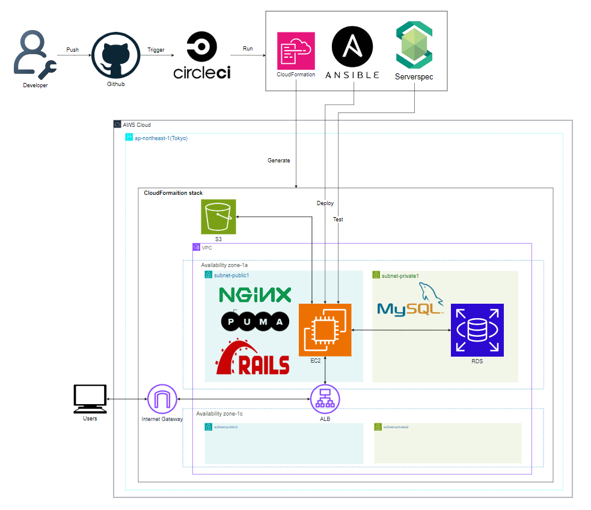

# Railsアプリケーションのインフラ構築と自動デプロイ

このリポジトリでは、AWSと自動化ツールを用いてRailsアプリケーションのインフラ構築および自動デプロイの実践内容を記録する。

## ■ インフラ自動化の全体フロー
### ◯ インフラ自動構築の流れ

#### 〇  GitリポジトリへのPushをトリガーにCircleCIにより、以下の処理を自動実行
1. AWSリソースのプロビジョニング
   - CloudFormationにより、VPC, ALB, EC2, RDS, S3などのAWSリソースを構築

2. Railsアプリのデプロイ環境構築
   - Ansibleにより、Rails実行環境（各種ミドルウェアや依存パッケージ）を構築

3. サーバー構成のテスト
   - Serverspecにより、構成されたサーバーが要件どおりに動作するかを検証

### ◯ 構成図
 
[構造図ファイル - rails-app-automation-architecture.drawio](./diagram/rails-app-automation-architecture.drawio)

## ■ 動作環境
### ◯ サンプルアプリケーション
[GitHubリポジトリ - yuta-ushijima/raisetech-live8-sample-app](https://github.com/yuta-ushijima/raisetech-live8-sample-app)

<table>
  <tr>
    <td>
      <b>使用技術(バージョン情報)</b>
      <table border="1" cellspacing="0" cellpadding="5">
        <tr><th>項目</th><th>バージョン</th></tr>
        <tr><td>Ruby</td><td>3.2.3</td></tr>
        <tr><td>Bundler</td><td>2.3.14</td></tr>
        <tr><td>Rails</td><td>7.1.3.2</td></tr>
        <tr><td>Node.js</td><td>v17.9.1</td></tr>
        <tr><td>Yarn</td><td>1.22.19</td></tr>
      </table>
    </td>
    <td style="padding-left: 40px;">
      <b>ミドルウェア・ストレージ</b>
      <table border="1" cellspacing="0" cellpadding="5">
        <tr><th>種別</th><th>使用技術</th></tr>
        <tr><td>Webサーバー</td><td>Nginx</td></tr>
        <tr><td>アプリケーションサーバー</td><td>Puma</td></tr>
        <tr><td>データベース</td><td>MySQL(Amazon RDS)</td></tr>
        <tr><td>ストレージ</td><td>Amazon S3</td></tr>
      </table>
    </td>
  </tr>
</table>

## ■ 学習内容と課題
| No. | 学習内容                        | 課題内容                                                               | 提出物                                 |
|-----|---------------------------------|------------------------------------------------------------------------|----------------------------------------|
| 1   | インフラ基礎・AWS概要           | AWSアカウント作成、IAM設定、Rubyスクリプト実行                        | Discordにて提出                         |
| 2   | Git・Markdown                  | GitHubアカウント作成、Markdownで授業の感想を記述しPR提出               | [lecture02.md](./lecture02.md)         |
| 3   | Webアプリの構成と開発の流れ    | Cloud9にRailsアプリをデプロイ、利用中のAPサーバーやDBを調査           | [lecture03.md](./lecture03/lecture03.md) |
| 4   | AWS基礎リソースの作成          | VPC、EC2、RDS を構築し、EC2 から RDS に接続できるか確認               | [lecture04.md](./lecture04/lecture04.md) |
| 5   | 負荷分散とS3の利用             | ALBを用いた負荷分散構成、S3への画像保存、インフラ構成図の作成         | [lecture05.md](./lecture05/lecture05.md) |
| 6   | ロギング・監視・コスト管理     | CloudTrailイベント確認、CloudWatchアラーム通知設定、AWS料金見積もり   | [lecture06.md](./lecture06/lecture06.md) |
| 7   | セキュリティの基礎             | 現在の構成の脆弱性を洗い出し、対策を検討                               | [lecture07.md](./lecture07/lecture07.md) |
| 8   | 環境構築の実演①                | -                                                                      | なし                                    |
| 9   | 環境構築の実演②                | -                                                                      | なし                                    |
| 10  | インフラ構成のコード化         | AWS構成をCloudFormationテンプレート化して再構築                        | [lecture10.md](./lecture10/lecture10.md) |
| 11  | インフラテスト（ServerSpec）   | ServerSpecを使って構成が正しいかを自動テスト                           | [lecture11.md](./lecture11/lecture11.md) |
| 12  | CI/CDとTerraformの基礎         | CircleCI導入と基本的なジョブの動作検証                                 | [lecture12.md](./lecture12/lecture12.md) |
| 13  | 自動化パイプライン構築         | CircleCIでCloudFormation → Ansible → ServerSpecを自動実行              | [lecture13.md](./lecture13/lecture13.md) |
| 14  | 環境構築の実演③                | -                                                                      | なし                                    |
| 15  | 環境構築の実演④                | -                                                                      | なし                                    |
| 16  | 現場で活きるスキルの整理       | 就職・転職を見据えた知識の整理と振り返り                               | なし                                    |
