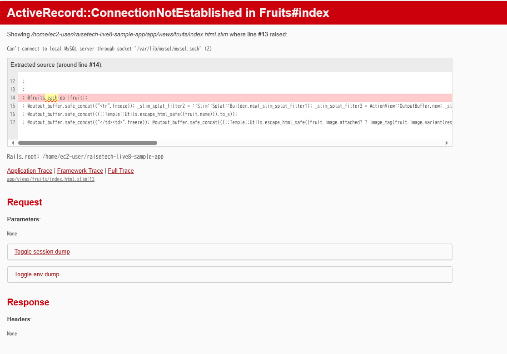

# 第3回課題

### APサーバー
- APサーバーの名前：Puma
- APサーバーのバージョン：V6.4.2

 
- APサーバーを終了させた場合, アクセスすることはできなかった。
   APサーバー終了コマンド

- 再度APサーバーを起動してアクセスした結果

### DBサーバー
- DBサーバーの名前：MySQL
- DBサーバーのバージョン：V8.4.2

- DBサーバーを終了させた場合, アクセスすることはできなかった。

### Railsの構成管理ツールの名前
- Bundler

### 課題から学んだこと、感じたこと

- サンプルアプリケーションを起動させるのに必要なruby, Railsなどのバージョンは最新であれば動作しそうと思ってしまうが、
システムにあったバージョンを使用しなければならないのは、大変勉強になった。
また、構成管理ツールを使用して、依存関係を成り立たせていくことを頭に入れて勉強するようにしていきたいと思った。

- サンプルアプリケーションを起動するのに、最初動画を真似して操作したもののエラーとなってしまい起動させることができなかった。
ただ、エラーメッセージの内容を一つずつ理解し、エラーを出さずに起動させることができたため、
エラーを解決するための能力を身につけることが大事だと実感した。