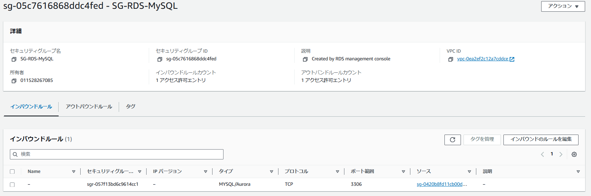

# 第4回課題

### 作成したVPC
- IPアドレス:10.1.0.0/21 
(Cloud9が使用できない状態で、課題2,3を実施するために「10.0.0.0/16」を占有するVPCを作成したため)
- サブネット:private 2, public 2

### 作成したEC2

### EC2のセキュリティグループ
- インバウンド [タイプ:SSH, プロトコル:TCP, ポート範囲:22, ソース:自PCのIPアドレス]
- アウトバウンド [全て]

### 作成したRDS

### RDSのセキュリティグループ
- インバウンド 
[タイプ:MySQL/Aurora, プロトコル:TCP, ポート範囲:3306, ソース:作成したVPCのIP] 
[タイプ:SSH, プロトコル:TCP, ポート範囲:22, ソース:作成したVPCのIP]
- アウトバウンド[全て]

### EC2からRDSへの接続

### 感想
EC2からRDSへの接続が最初は上手くできなかった。セキュリティグループの理解があまりできておらず、セキュリティグループの設定を変更することで上手く接続させることができた。全体の構成やリソース間のつながり,役割を理解することが大事だと実感した。
