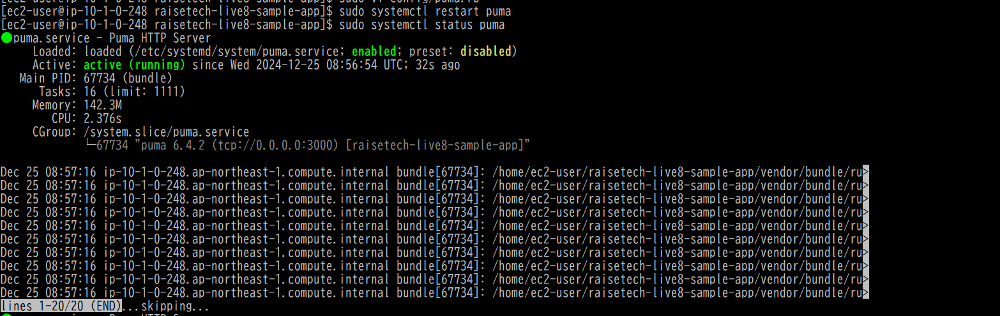
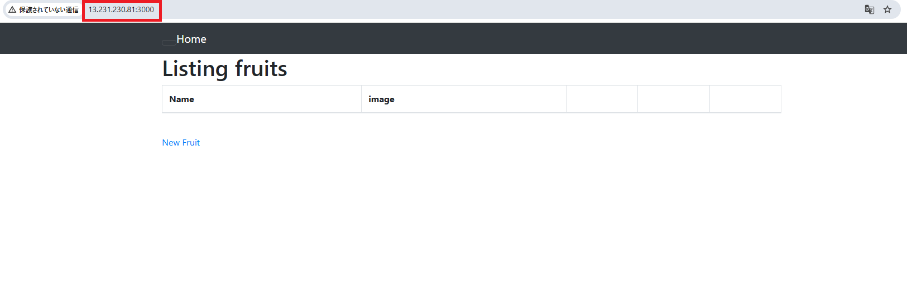
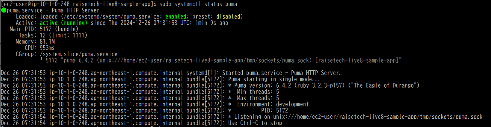
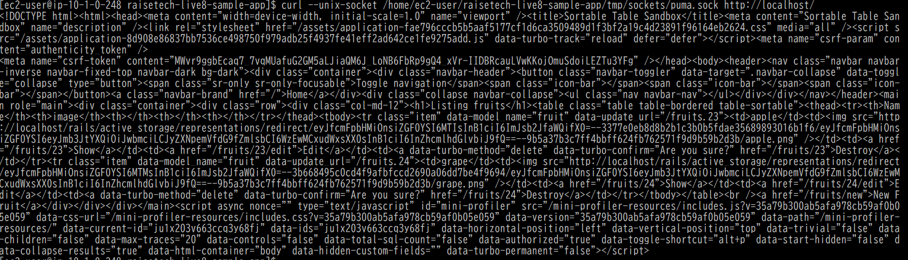
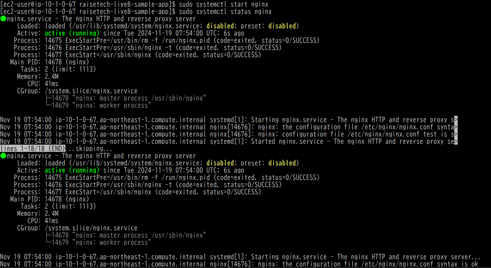
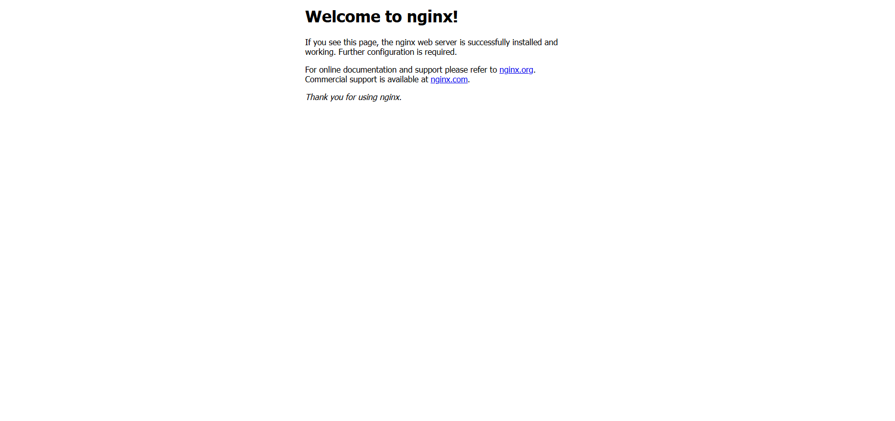
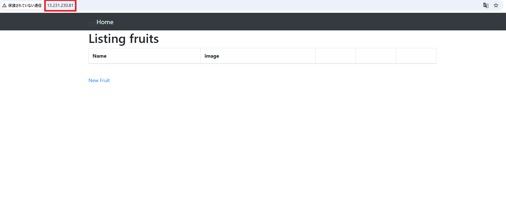
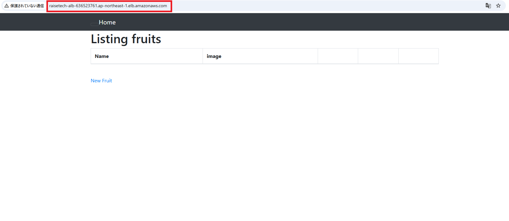
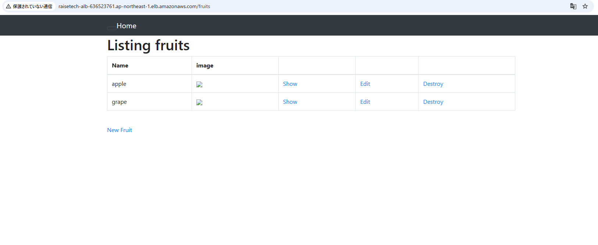
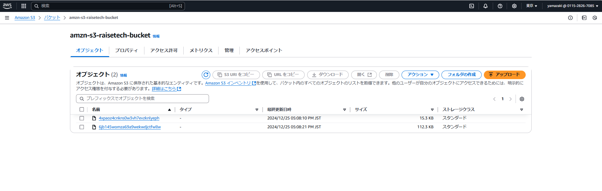

# 第5回課題

### 組み込みサーバー（Puma）でのRailsアプリケーション動作確認
- pumaの状態(ポート3000で待機状態)
  
- webブラウザでポート3000にアクセスし、railsアプリが表示されることを確認

### 組み込みサーバーとUnix Socketを使ったRailsアプリの動作確認
- pumaの状態(Unix Socketで待機状態)
  
- pumaのUnix Socketへcurlにてリクエストを送信し、HTMLファイルが返って来ることを確認

### Nginxの単体起動確認
- Nginxの状態
  
- webブラウザでポート80にアクセスし、Nginx初期画面が表示されることを確認

### Nginxと組み込みサーバー、Unix Socketを組み合わせてのRailsアプリケーション動作確認
- webブラウザでポート80にアクセスし、railsアプリが表示されることを確認

### ALB経由でEC2へ接続
- webブラウザでALBのDNA名にアクセスし、railsアプリが表示されることを確認

### S3追加
- 画像がS3に保存されるように設定した後、webブラウザで画像を登録
  
- S3に画像が保存されたことを確認

### 構造図

### 課題から学んだこと、感じたこと
- 課題3を実施した際には、コマンドの意味を深く考えずに実行した。今回の課題では手詰まりになることが多く、コマンドを実行する際には、その内部で何が行われているのかを一つずつ理解するようにしたら、うまく進めることができた。当たり前ですが、手順一つずつに意味があるので、その手順にどういった意味があるのかを理解して実施することが大事だと実感した。
