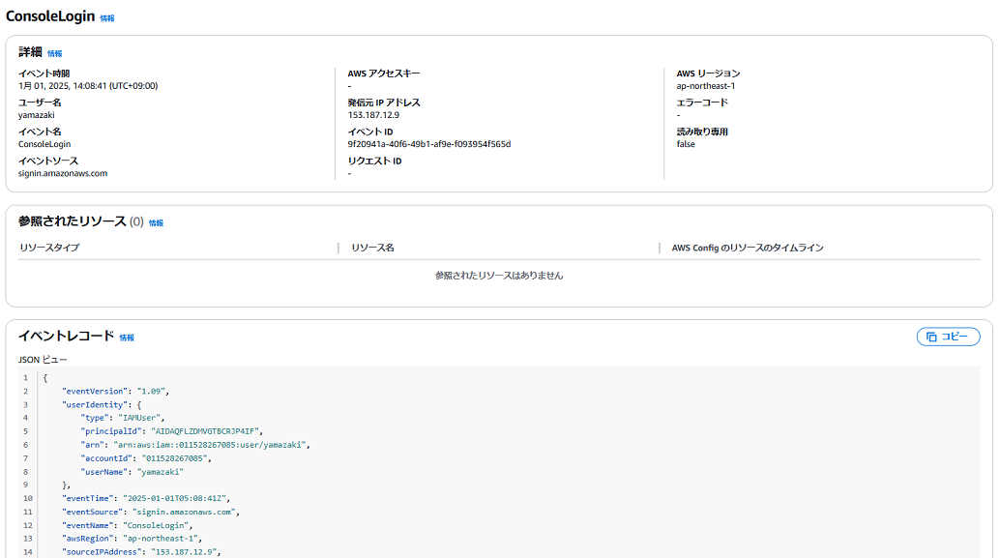
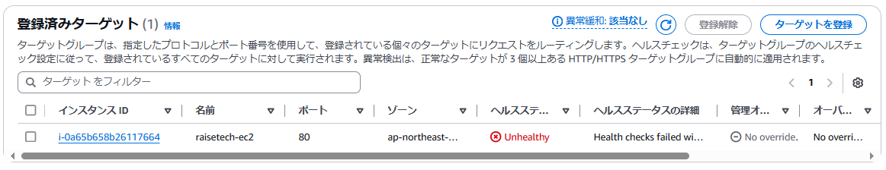
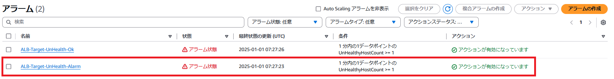
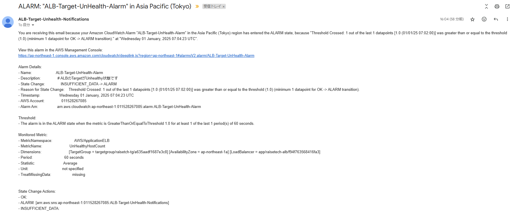
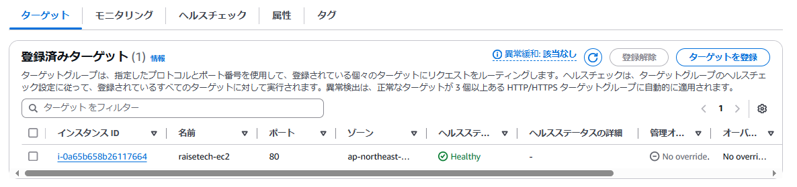
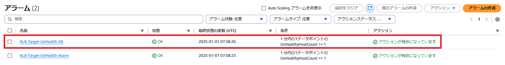
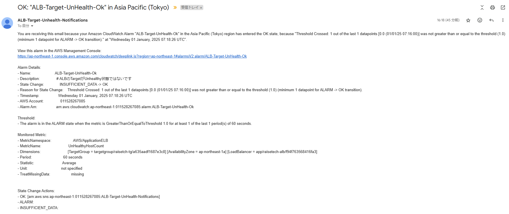
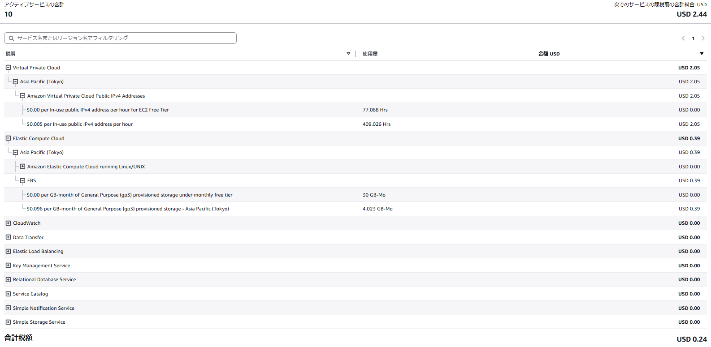

# 第6回課題

### CloudTrailにてイベントをピックアップ
- イベント名：ConsoleLogin 
  - IAMユーザーがAWSコンソールにサインインした時のイベント
- 含まれている内容
   - イベント時間： "eventTime": "2025-01-01T05:08:41Z"
   - イベントソース： "eventSource": "signin.amazonaws.com"
   - AWSリージョン: "awsRegion": "ap-northeast-1"

### CloudWatch AlarmとSNSを使ったメール通知
- CloudWatchでUnHealthyHostCountのAlarmアクション確認
   - ALBのtargetのヘルスチェックでUnHealthy状態

   - CloudWatch アラームの状態(アラーム状態)

   - SNSでのメール受信

- CloudWatchでUnHealthyHostCountのOKアクション確認
   - ALBのtargetのヘルスチェックがHealthy状態

   - CloudWatch アラームの状態(OK)

   - SNSでのメール受信

### AWS利用料の見積り(URL)
https://calculator.aws/#/estimate?id=8847598a9e8f6edbc1eee793d987e79554790ce7

### 2024年12月の利用料(EC2の利用料)

### 考察
- 第5回の課題を実施するにあたり、色々と試すために複数のEC2を作成してしまっていた。 
EC2は停止していれば費用は発生しないが、EC2と一緒に作成されたEBSは、EC2が停止していても費用が発生することを認識しておらず、EBSの無料枠を超えたため、費用が発生してしまった。 

- 対策として無料枠を超えないように利用状況を監視するために、CloudWatch アラームを設定し、無料枠を超過しそうな場合に通知を受け取るようにする。