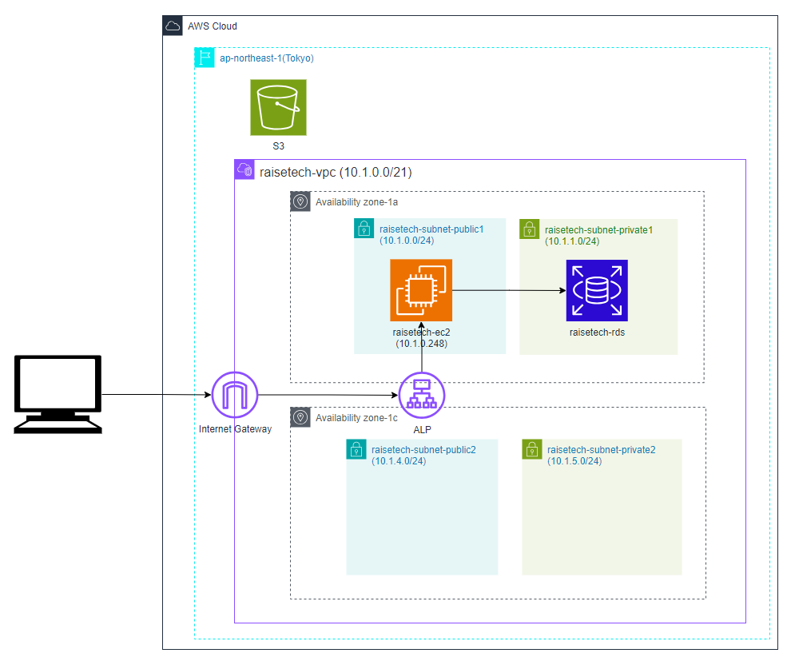
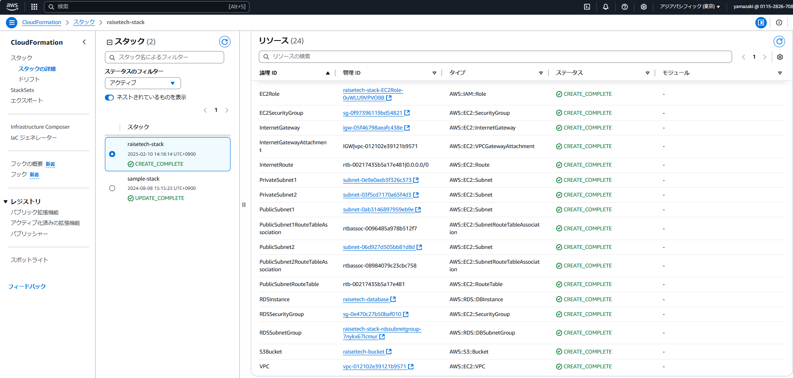

# 第10回課題
## 現在までに作った環境をCloudFormationで作成
### 下記構成でCloudFormationのテンプレートを作成

### [CloudFormation Templateファイル参照先](template/template_lecture10.yml)

### スタック作成

### 大変だったこと
- 各リソースにどのような要素(Properties)があるのか調べるのが大変だった。
- テンプレートファイルにエラーが最初頻発していたため、エラーを消す作業が大変だった。またスタック作成中にリソースの作成に失敗した時、その原因が抽象的にしか記載されていないことが多かったため、本当の原因を特定するのに手間がかかった。

### 感想
- 一度Templateファイルを作成すれば、何度でも同じ環境(スタック)を作成できるので、とても便利だと思った。また各リソースの関係性(ECとセキュリティグループなど)も一元管理できる良いと思った。