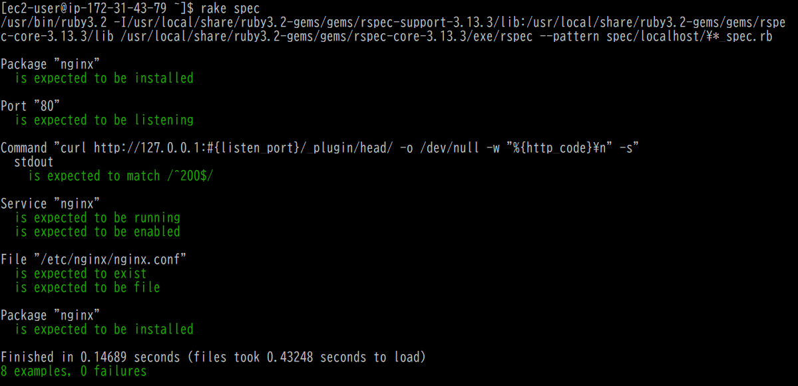

# 第11回課題
## 課題の内容
- ServerSpecにてテストが成功することを確認 
(新規作成したEC2インスタンスにNginxをインストールして確認)

[使用したテストスクリプトファイル(sample_spec.rb)](sample_spec.rb)

## 感想
- インフラのテストをどのように実施するかについて疑問に思っていたが、ServerSpecのようなツールを使えば、自動化して効率的にテストできることが分かり、非常に便利だと感じた。

- ただ、テストスクリプト自体もコード化されているため、スクリプトに不備があると、意図した箇所ではなく別の箇所のテストを実施してしまう可能性もある。もしそのまま「OK」となってしまうと、実際の問題に気づけないことになるので、テストスクリプトをしっかり確認することが大切だと感じた。便利な一方で、その部分の確認作業は少し大変だなと思った。