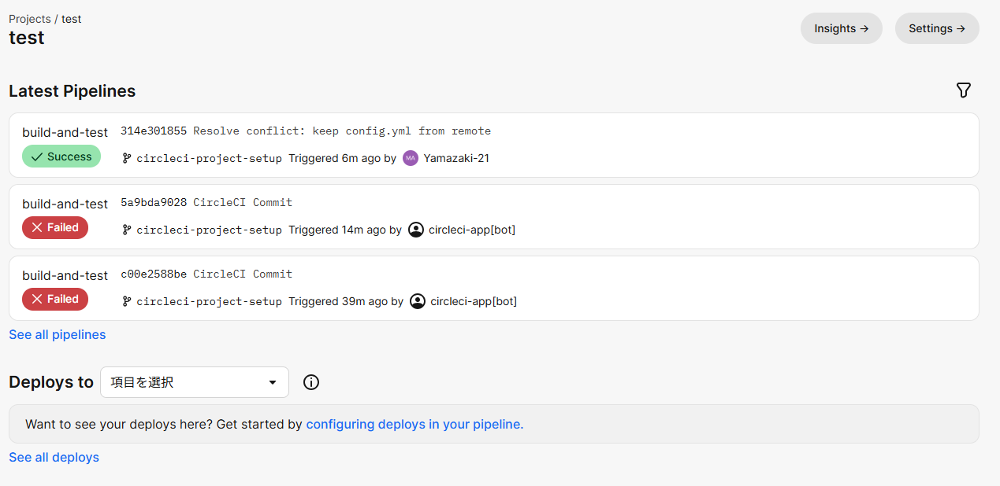

# 第12回課題
## 課題の内容
- CircleCIが正しく動作するように本リポジトリに組み込み、失敗/成功することを確認

[使用したコンフィグファイル(config.yml)](../.circleci/config.yml)

## 実施した手順
1. CircleCIの新規アカウントを作成
2. GitHubの本リポジトリを指定してプロジェクトを新規作成
3. 自動的にディレクトリとコンフィグファイルが生成(新規ブランチに生成)されるので、提供された以下のコンフィグファイルに置き換え
https://github.com/MasatoshiMizumoto/raisetech_documents/blob/main/aws/samples/circleci/config.yml
4. パイプラインを実行すると失敗
5. 警告に従ってテンプレートファイルを修正（RDSのパスワードが静的なパラメータとなっていたため、Secrets Managerを参照するように修正）し、push
6. テンプレートファイルをpushすることで、自動でパイプラインが実行され成功

## 感想
- CircleCIを使うことで、コードをpushするたびに自動でテストが行われるため、毎回自分で確認する手間がなくなり、とても便利だと感じた。
- 説明を聞いただけではCI/CDの意味がよくわからなかったが、課題に取り組むことで理解が深まった。不明な点はまだあるが、実践を通して理解が進んだと思う。