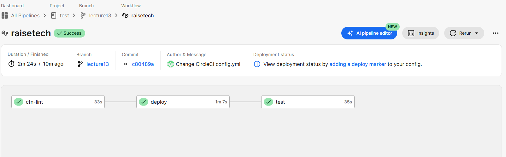

# 第13回課題
## 課題の内容
- 手動で作成したEC2インスタンスに対して、CircleCI上でAnsibleによるデプロイとServerspecによるテストを自動化し、成功することを確認

[使用したコンフィグファイル(config.yml)](../.circleci/config.yml) 
※ファイル作成以外の設定として、EC2接続用SSHキーをCircleCIの設定画面から追加
## 感想
- 最初は課題の意図がよくつかめなかったが、進めていくうちに、これまで手動で行っていた作業がすべて自動化できるとわかり、大変感動した。
- 今回は nginx のインストールとそのテストのみを自動化したが、今度はもっと大規模な構成にも挑戦したいと思う。