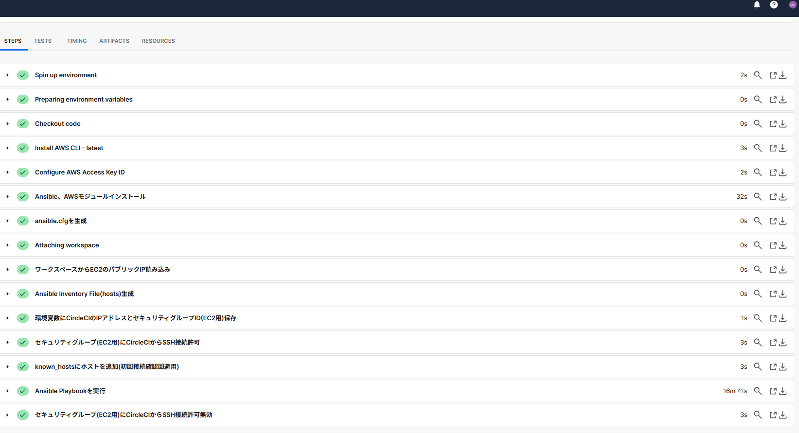
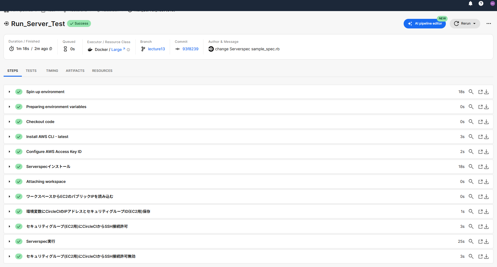
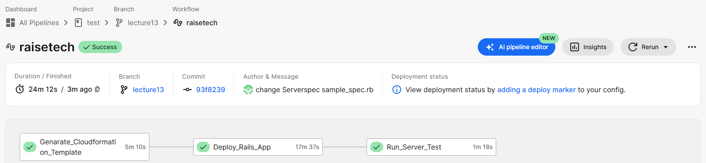
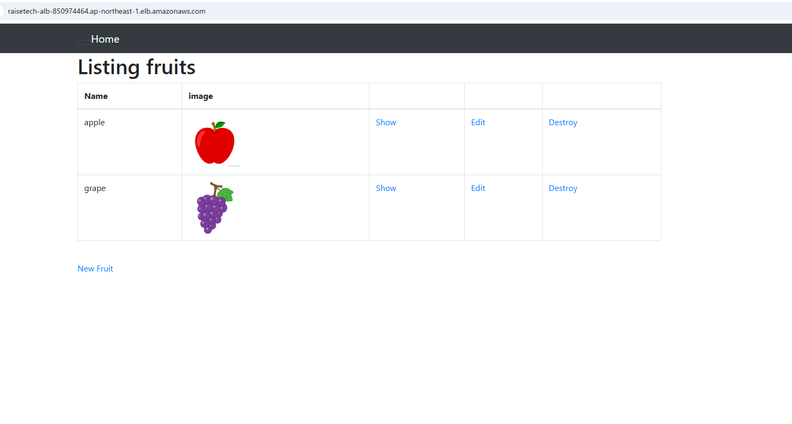
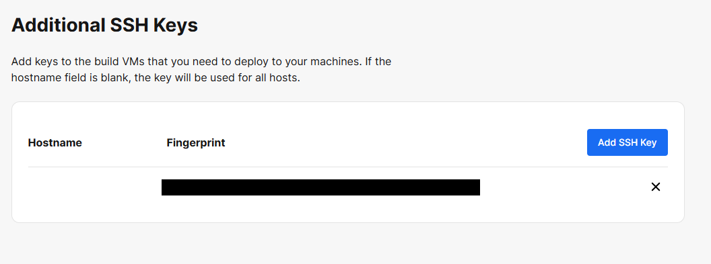
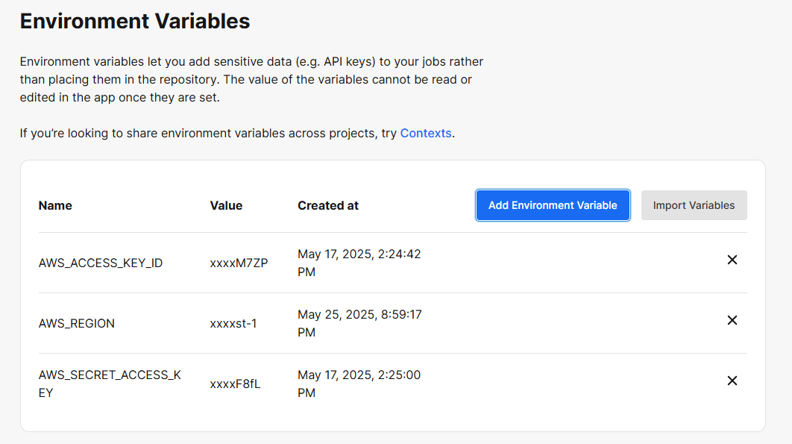

# 第13回課題
## 課題の内容
- CircleCIを使用し1～3を実施、全て成功することを確認
1. Cloudformationのスタック作成[(使用したCloudformationテンプレートはこちら)](../cloudformation)

2. AnsibleでEC2にRailsアプリをデプロイ[(使用したAnsible環境はこちら)](../ansible)

3. ServerspecでEC2のテストを実施[(使用したServerspec環境はこちら)](../serverspec) 

- Railsアプリが動作していることを確認

- ファイル作成以外の設定として以下を実施 
EC2接続用SSHキーをCircleCIの設定画面(Additional SSH Keys)から追加(EC2はCloudformationで作成するためIPアドレスが不定、hostは空を登録)

環境変数をCircleCIの設定画面(Environment Variables)から追加

## 感想
- 最初は課題の意図が掴みめず、全体像が見えなかったが、実際に手を動かして進めるうちに、これまで手動で行っていた作業が完全に自動化できることに大変感動した。
- 課題の完了までに約2週間かかったが、トラブルやエラーを一つずつ丁寧に解決する過程で、インフラ自動化やデプロイの仕組みについての理解が大きく深まった。まだ理解が浅い部分もあるため、引き続き学習を続けて理解度を高めたいと考えている。